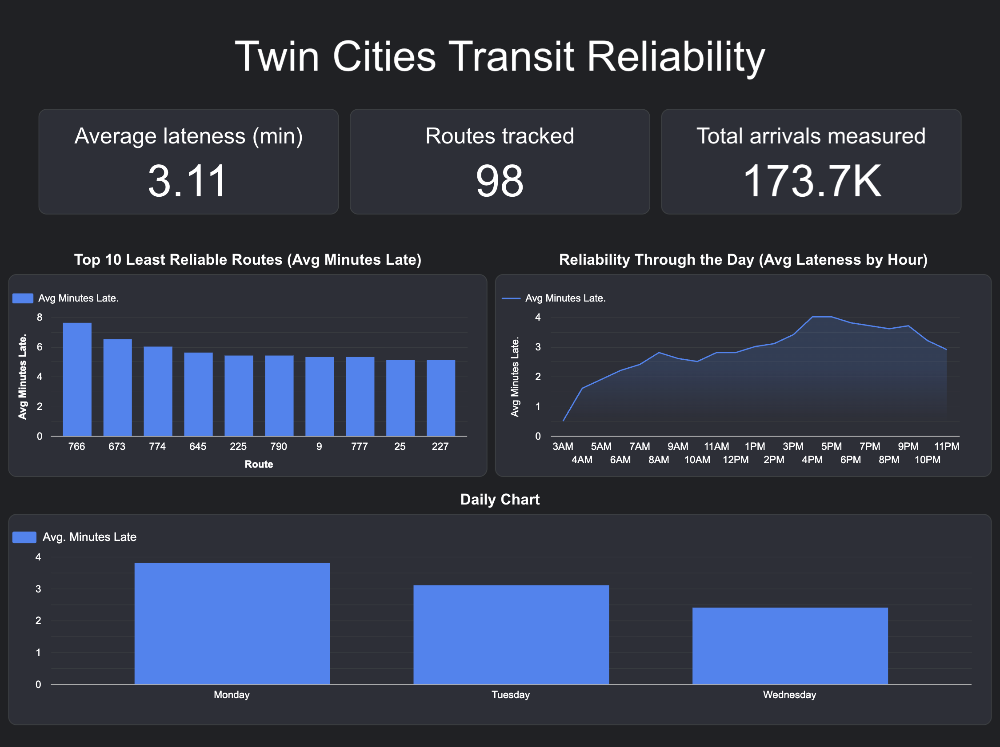
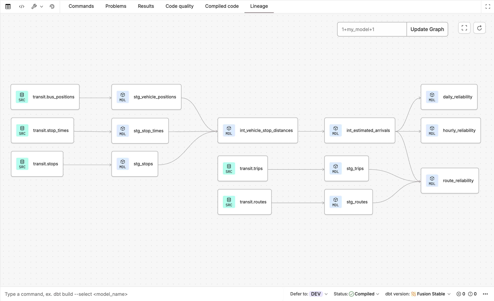

# Twin Cities Transit Reliability Pipeline

[](https://www.python.org/)
[](https://cloud.google.com/bigquery)
[](https://www.getdbt.com/)
[](https://dagster.io/)
[](https://cloud.google.com/bigquery/docs/reference/standard-sql)
[](https://lookerstudio.google.com/)


-blue?style=flat-square)


An end to end ELT pipeline that ingests live Twin Cities bus and train
positions, matches them against the published schedule, and measures how
reliable each transit route actually is. Built on real, continuously
collected data, transformed in a cloud warehouse with a layered dbt
project, and served through an interactive dashboard.



*Interactive Looker Studio dashboard reading from BigQuery.*

---

## Architecture

```
   Metro Transit Realtime API  ─┐
   (live vehicle positions)     │
                                 ├─► Python ─► BigQuery ─► dbt ─► Looker Studio
   Metro Transit GTFS ──────────┘   (E + L)   (warehouse) (T)    (dashboard)
   (published schedule, CSV)             ▲
                              Dagster schedules the collector
```

A layered (medallion) dbt project turns raw positions into insight:

```
sources (raw)  ─►  staging (stg_)  ─►  intermediate (int_)  ─►  marts
```



*The dbt lineage graph: raw sources through staging and intermediate models
into the final marts.*

---

## Tech stack

| Layer            | Technology                                   |
|------------------|----------------------------------------------|
| Languages        | Python, SQL                                  |
| Ingestion        | Python (requests, pandas, pandas-gbq)        |
| Orchestration    | Dagster (scheduled collector asset)          |
| Warehouse        | Google BigQuery                              |
| Transformation   | dbt (layered models + data quality tests)    |
| BI / Dashboard   | Looker Studio                                |
| Version control  | Git and GitHub                               |
| Cloud / Auth     | Google Cloud IAM, service accounts           |

---

## How it works

The live data never says "the bus arrived at stop X." It only reports where
each vehicle is (latitude and longitude) at each moment. Turning that into
"was this bus on time?" is the core engineering challenge.

### 1. Extract and Load (Python + Dagster)
A Python collector calls Metro Transit's live vehicle API, filters out non
reporting vehicles (a large share of raw records report 0,0 coordinates,
buses assigned but not yet transmitting GPS), timestamps each pull, and
appends the clean records to BigQuery. Dagster runs the collector on a
schedule. Two source types are handled: a live JSON API (vehicle positions)
and a bulk file download (the GTFS schedule as CSVs).

### 2. Transform (dbt on BigQuery), the hard part
The dbt project is layered into staging, intermediate, and marts:

- Staging (stg_): one model per source, cleans and standardizes types once
  so downstream models stay simple.
- Intermediate (int_): the analytical core.
  - Geospatial distance: each vehicle position becomes a geography point
    with ST_GEOGPOINT, and ST_DISTANCE computes the true distance to every
    stop on the vehicle's own scheduled trip.
  - Correct stop matching: vehicles are joined only to stops their trip
    actually serves, so a bus cannot match a stop on a different route.
  - Arrival detection: a window function finds the moment of closest
    approach to each stop, the estimated arrival. Points beyond 150m are
    dropped as "never actually arrived."
  - Lateness: timestamps are localized to Central Time and differenced
    against the scheduled arrival, with safe parsing for GTFS after
    midnight times (24:00+).
- Marts: route, hourly, and daily reliability, each with average lateness,
  arrival counts, and an on-time percentage (share of arrivals within a 1
  minute early to 5 minute late window, the metric transit agencies use).

### 3. Serve (Looker Studio)
A dashboard reads the marts from BigQuery: a ranking of the least reliable
routes, a line chart of reliability across the day, a day of week
breakdown, and summary scorecards (average lateness, routes tracked, and
total arrivals measured).

---

## Data models

| Model                       | Layer        | Purpose                                  |
|-----------------------------|--------------|------------------------------------------|
| stg_vehicle_positions       | staging      | Clean live vehicle positions             |
| stg_stop_times              | staging      | Clean scheduled stop times               |
| stg_trips                   | staging      | Trip to route mapping                    |
| stg_stops                   | staging      | Stop locations                           |
| stg_routes                  | staging      | Route id to readable route name          |
| int_vehicle_stop_distances  | intermediate | Distance from each position to its stops |
| int_estimated_arrivals      | intermediate | One estimated arrival per trip and stop  |
| route_reliability           | mart         | Reliability ranked by route              |
| hourly_reliability          | mart         | Reliability by hour of day               |
| daily_reliability           | mart         | Reliability by day of week               |

Data quality is enforced with dbt tests (not_null, unique, accepted_values)
across the models.

---

## Environments

The project uses separate dbt environments, matching real team practice:

- Development builds into a dev dataset for testing changes safely.
- Production builds into a separate prod dataset on a scheduled dbt job, so
  transformations refresh automatically and the dashboard always reads
  clean, production data. Development work never touches production tables.

---

## Key findings

*Figures are regenerated from the current data; see the live dashboard for
the latest.*

- Reliability degrades through the day and is worst during the afternoon
  and evening rush, then recovers late at night. Early morning service is
  the most reliable.
- Rail lines (the METRO lettered lines) are among the most reliable in the
  system, measured across thousands of arrivals each.
- Several local bus routes rank as the least reliable.
- On-time percentage per route lets these numbers be compared directly with
  Metro Transit's own published on-time performance.

---

## Data quality and honest limitations

- Arrival times are estimated from GPS position snapshots (closest
  approach), not exact arrival events.
- Arrival matching currently uses proximity; stop ordering and direction of
  travel are not yet used to disambiguate an already passed stop from an
  upcoming one (a planned refinement).
- Results reflect the data collected so far; the pipeline is live and
  growing, so day of week patterns strengthen over time.
- Very early values are filtered to a realistic range to remove measurement
  noise, and after midnight GTFS times are handled with safe parsing.

Being explicit about limitations is intentional. Trustworthy analysis means
being clear about what the numbers can and cannot say.

---

## Repository structure

```
mn-transit-pipeline/
├── ingestion/            # Python collector (extract and load to BigQuery)
├── orchestration/        # Dagster project (schedules the collector)
├── models/               # dbt project
│   ├── staging/          # stg_ models + sources
│   ├── intermediate/     # int_ models (distance + arrival logic)
│   ├── marts/            # route, hourly, daily reliability
│   └── schema.yml        # data quality tests
├── docs/                 # dashboard and lineage screenshots
└── README.md
```

---

## Running it

```bash
# Collector (extract + load), scheduled via Dagster:
dg dev

# Transformations (build models and run tests):
dbt build
```

The production dbt job runs on a schedule in dbt Cloud against the prod
dataset, so transformations refresh without manual runs.

---

## Roadmap

- [ ] Wire dbt into Dagster so one orchestrator runs collection and
      transformation as a single lineage
- [ ] Host the collector off local machine (e.g. Cloud Run job on a
      schedule) for fully unattended operation
- [ ] Incremental models and BigQuery partitioning / clustering, with
      before and after query cost
- [ ] CI with GitHub Actions running dbt build on every pull request
- [ ] Business logic tests (max distance from stop, arrivals within service
      hours, arrivals not exceeding scheduled stops)
- [ ] Add weather data to study its impact on reliability

---

## License

MIT
